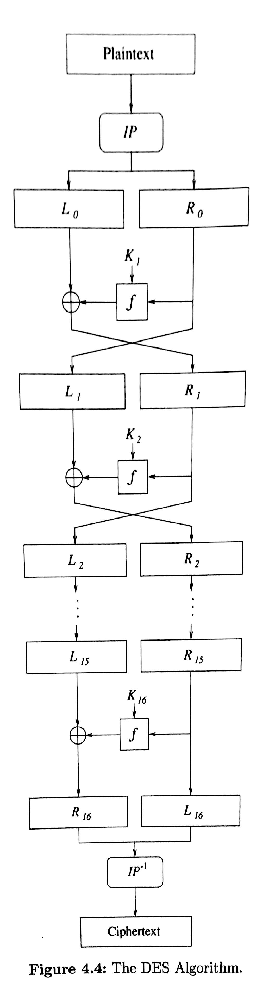
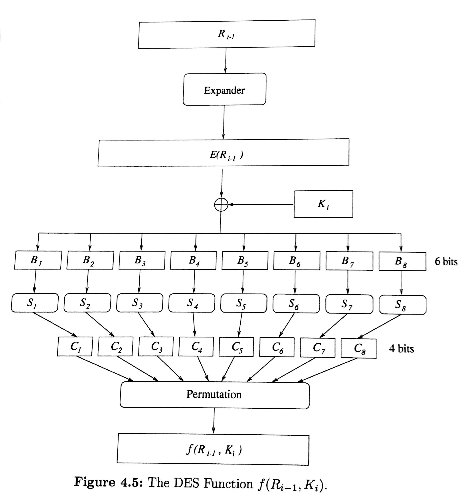

```{r setup, include=FALSE}
knitr::opts_chunk$set(echo = TRUE)
knitr::opts_chunk$set(comment = NA)
options(width = 100)
library(gmp)
```

# DES

## {data-background="https://honda-tech.com/wp-content/uploads/2020/01/cvcc6-e1578901622925.jpg" data-background-size="contain"}

## {data-background="http://www.rockmusictimeline.com/beegees_75.jpg" data-background-size="contain"}

## {data-background="https://upload.wikimedia.org/wikipedia/commons/2/2d/IBM_5100_-_MfK_Bern.jpg" data-background-size="contain"}

## DES: Data Encryption Standard (1975)

What you must know:

- DES is a block cipher.
- DES is a symmetric key cryptosystem.
- **DES is no longer considered secure.**

## History of DES and AES

- 1973 NBS (now NIST) issues public call for proposals
- 1974 IBM responds with LUCIFER, NBS sends LUCIFER to NSA
- 1975: NBS release DES, NSA's modification to LUCIFER
- 1998: Electronic Frontier Foundation (EFF) cracks DES in 56 hours
- 1999: NIST recommends Triple DES (3DES), but also reaffirms DES
- 2002: AES becomes official government standard
- 2005: NIST no longer affirms DES
- 2020: AES remains state-of-the-art

## Overview of the DES algorithm 

<div class="column-left">

```{r, out.height = "540px", out.width="200px",echo=FALSE, fig.align='center'}

```

</div>

<div class="column-right">

Plaintext block: $m$, 64 bits

Key: $K$, 56 bits + 8 parity bits.

1. $m_0 \leftarrow \sigma(m)$, where $\sigma$ is a fixed initial permutation. Let $m_0=L_0R_0$, the left and right 32 bits

2. For $i$ in $1\ldots 16$, $L_i \leftarrow R_i$, and $R_i \leftarrow L_{i-1}\oplus f(R_{i-1}, K_i)$, where $K_1,\ldots,K_{16}$ are 48-bit subkeys generated by a *key schedule*. (The function $f$ is described below.)

3. Ciphertext $\leftarrow \sigma^{-1}(R_{16}L_{16})$

</div>

## Decryption 

<div class="column-left">

```{r, out.height = "540px", out.width="200px", fig.align='center', echo=FALSE}

```

</div>

<div class="column-right">
Decryption uses the exact same procedure, but with the order of the $K_i$'s reversed. (Feistel network.)
</div>

## The DES function $f$, and S-Boxes 

<div class="column-left">

```{r, out.height = "540px", out.width="500px",echo=FALSE}

```

</div>
<div class="column-right">

Inputs: $R_{i-1}$ (32-bit) and $K_i$ (48-bit)

1. Expand $R$ to $E(R)$ (48-bit), via a fixed expansion function.

2. $B \leftarrow E(R) \oplus K_i$, where $B=B_1B_2\cdot B_8$ is broken into 8 6-bit substrings.

3. Using a different (fixed) lookup table, i.e. "S-Box", for each $B_i$, compute $C_1, \ldots C_8$ (4-bit each).

4. $f(R_{i-1}, K_i) \leftarrow \alpha(C_1C_2\ldots C_8)$, where $\alpha$ is a fixed permutation.

</div>

## Remarks on DES

- The calculation of each bit of ciphertext depends on every bit of plaintext. (Diffusion.)
- The calculation of each bit of ciphertext depends on every bit of the key. (Confusion.)
- Simple mathematical tools: Addition in $\mathbb{Z}_2^n$, permutations, functions given by tables.

## The problem with DES: key size

DES is vulnerable to brute-force attacks (try every key). 

$2^{56} \approx 7.2 \times 10^{16}$. 

## How about double DES?

Encrypting twice with DES is not the same as encrypting once with a different key (unlike most/all of the ciphers we have seen so far). "DES is not a group."

Let $K$, $L$ be two DES keys, let $m$ be a plaintext block, and denote the encryption function by $D$.
$$
\begin{aligned}
c &\leftarrow D(m, K) \\
d &\leftarrow D(c, L)
\end{aligned}
$$

There is no key $M$ such that $d = D(m, M)$.

## Meet-in-the-Middle Attack {.build}

Known or chosen plaintext $m$.

1. Alice double encrypts plaintext $m$ using keys $K$ and $L$ and sends ciphertext $d$ to Bob.
$$
d \leftarrow D(D(m,K), L)
$$
2. Eve intercepts both $m$ and $d$. 
3. Eve stores $D(m,J_i)$ for all possible keys $J_i$.
4. Eve calculates $D^{-1}(d, J_i)$ for each possible key $J_i$, noting all matches found with the list stored in step 3. The keys $K$ and $L$ will correspond to one of these matches.

Time (in number of $D$ calls)? vs. brute-force attack?

## How About Triple DES?

A MITM attack still works (in theory), but it takes longer.

Known or chosen plaintext $m$.

1. Alice triple encrypts plaintext $m$ using keys $K$, $L$, and $M$, and sends ciphertext $d$ to Bob.
$$
d \leftarrow D(D(D(m,K), L), M)
$$
2. Eve intercepts both $m$ and $d$. 
3. Eve stores $D(D(m,J_i),I_i)$ for all possible key pair $I_i, J_i$.
4. Eve calculates $D^{-1}(d, J_i)$ for each possible key $J_i$, noting all matches found with the list stored in step 3. The keys $K$, $L$, and $M$ will correspond to one of these matches.

# Finite Fields

## Finite Fields: Overview 

Some of this material is covered on pp. 93--97 of the book, but their notation is nonstandard. *Be able to answer the following:*

1. What is the definition of a field?
2. How are finite fields represented using polynomials?
3. If $F = R[x]/(p(x))$ is a field, what must be true about the polynomial $p(x)$? Why?
4. For which integers $n$ is there a field of size $n$? What does GF stand for?
5. How many elements are in the field $\mathbb{Z}_p[x]/(p(x))$?
6. What are the elements of $\mbox{GF}(4)$? How do these elements multiply?
7. How is $\mbox{GF}(2^8)$ represented?
8. How do you find inverses in a finite field?

## Fields

- A *field* is a commutative ring where every nonzero element is invertible.
     - Examples: real numbers, rational numbers, $\mathbb{Z}_p$ for $p$ prime.
     - Nonexamples: integers, $\mathbb{Z}_{26}$, invertible matrices

## Polynomial rings 

>- The ring $\mathbb{Z}_2[x]$ is the set of all polynomials in $x$ with coefficients in $\mathbb{Z}_2$. (e.g., things like $x^{31} + x^{3} + 1$)
>- These polynomials multiply and add in the usual way, forming a *ring*.
>- This ring is definitely not a field, because when you multiply polynomials, the degree can only go up.
>- You can make polynomial rings over other rings/fields besides $\mathbb{Z}_2$, but most of our examples will be over $\mathbb{Z}_2$.

## "Modding" by a polynomial

>- Given a fixed polynomial $p(x)$, we can form a *quotient ring* $\mathbb{Z}_2[x]/(p(x))$.
>- Multiplication and addition works in the usual way, except we require that $p(x)$ is equivalent to zero.
>     - This is just like how $\mathbb{Z}_{26}$ works: you multiply and add in the usual way, but you regard 26 as equivalent to zero. 
>- Example: $\mathbb{Z}_2[x]/(x^3 + x^2 + 1)$. (board)

## Observations

>- The modulus polynomial $p(x)$ needs to be *irreducible* in order for inverses to exist.
>- If $p(x)$ has degree $n$, then all of the elements in $\mathbb{Z}_2[x]/(p(x))$ are represented by polynomials of degree less than $n$.
>     - This is analogous to all of the elements of $\mathbb{Z}_{26}$ being represented by integers $0,1,2,\ldots, 25$.
>- So the size of $\mathbb{Z}_2[x]/(p(x))$ is $2^n$, where $n$ is the degree of $p(x)$.
>- There is a natural correspondence between the elements of $\mathbb{Z}_2[x]/(p(x))$ and binary strings of length $n$. (e.g., $x^7 + x^5 + x + 1 \leftrightarrow 10100011$)

## {data-background="https://upload.wikimedia.org/wikipedia/commons/5/53/Evariste_galois.jpg" data-background-size="contain"}

## The Galois Field $\text{GF}(2^n)$

- When $p(x)$ is irreducible of degree $n$, the field $\mathbb{Z}_2[x]/(p(x))$ is called **the** *Galois Field* of order $2^n$, or $\text{GF}(2^n)$.
- Different choices irreducible polynomial of degree $n$ all result in the same field, *up to isomorphism*. (The representation is different, but the pattern of the multiplication table is the same.)

## Join your table group

```{r, echo=FALSE}
library(knitr)
roster <- c("Sam", "Wesley", "Andrew", "Winston", "Michael", "Logan", "Christian", "Caleb", "James", "Joe", "Emily", "Nathan")
set.seed(9222020) 
n <- length(roster)
ngps <- 3
maxingp <- ceiling(n/ngps)
# just make random groups
groups <- matrix(c(roster[sample(n)], 
                   rep("",(maxingp - (n %% maxingp)) %% maxingp)), 
                 ncol=maxingp, byrow=FALSE)
rownames(groups) <- paste0("Table #", 1:nrow(groups))
kable(t(groups))
```

Work on your group's [Jamboard](https://jamboard.google.com/d/1i7R8aTDD4WqKf31Mf0v4Ipf9uOKv7yYjUq7qSy73dlk/edit?usp=sharing). 

## Group Activity

1. Find an irreducible polynomial $p(x)$ of degree 2 in $\mathbb{Z}_2[x]$. (Remember that a quadratic is irreducible iff it has no roots.)
2. Write down all the elements of $\mathbb{Z}_2[x]/(p(x))$, represented as polynomials.
3. Represent each element as a binary string.
4. Make addition and multiplication tables for these binary strings.
5. Identify the inverse of each nonzero element.

## Bytes and $\text{GF}(256)$

- Next time we'll talk about AES.
- AES uses multiplication in $\text{GF}(256)$ as part of its encryption function.
- The standard representation of $\text{GF}(256)$ is $\mathbb{Z}_2[x]/(x^8+x^4+x^3+x+1)$.
- The elements of $\text{GF}(256)$ are *bytes*!

## Finding inverses

- By inspection ([homework](../assignments/07mitmff.html))
- As a lookup table (ugh)
- Using the Extended Euclidean Algorithm (it works for polynomials too!)
