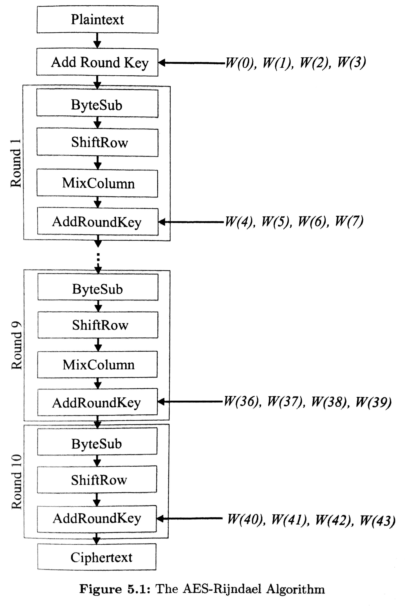
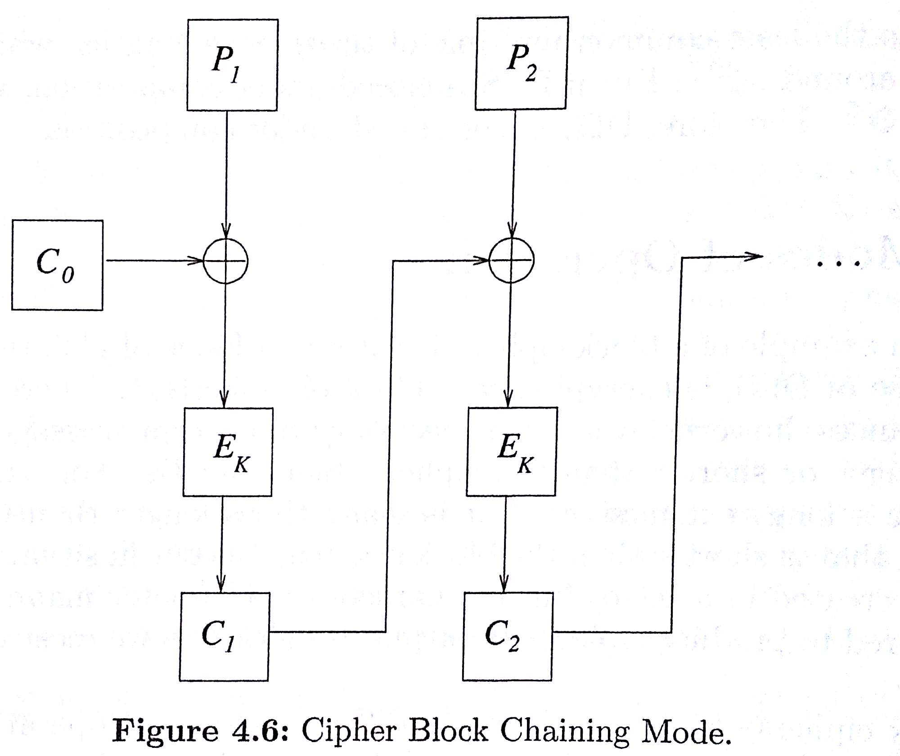
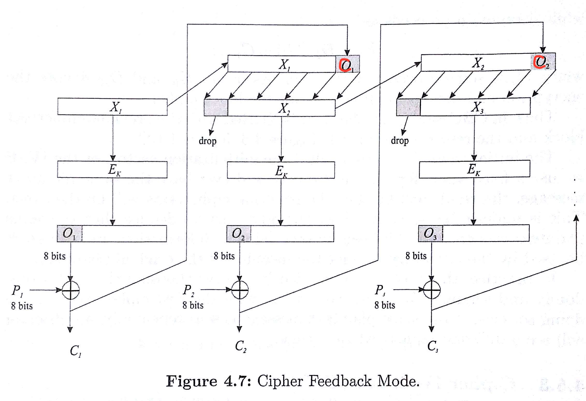
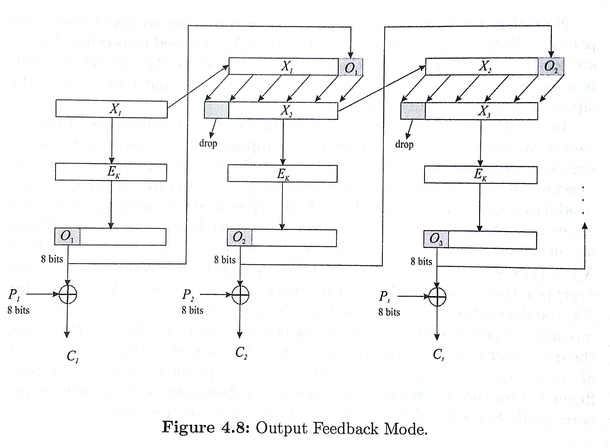
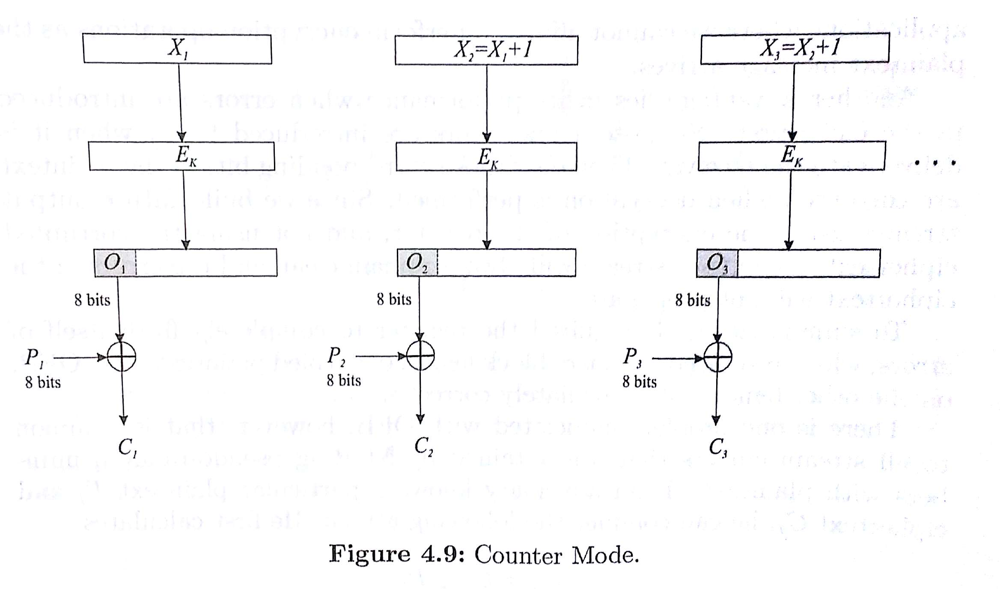

```{r setup, include=FALSE}
knitr::opts_chunk$set(echo = TRUE)
knitr::opts_chunk$set(comment = NA)
options(width = 100)
library(digest)
letterCounts <- function(txt)
{
  return(sort(table(unlist(strsplit(txt,""))),decreasing=TRUE))
}
```

# Finite Fields and Cryptography

## Bit strings and finite fields

In your last assignment, you investigated the field $\mbox{GF}(2^3) = \mathbb{Z}_2/(1+x+x^3)$.

Identify the 3-digit bit string $b_1b_2b_3$ with the polynomial $b_1x^2+b_2x+b_3$. That is,
$$
\begin{aligned}
000 &\leftrightarrow 0 \\
001 &\leftrightarrow 1 \\
010 &\leftrightarrow x \\
011 &\leftrightarrow x+1 \\
100 &\leftrightarrow x^2 \\
101 & \leftrightarrow x^2+1 \\
110 & \leftrightarrow x^2+x \\
111 & \leftrightarrow x^2+x+1
\end{aligned}
$$

## Warm-up: A "multiplication" cipher

Define an encryption function $E:\mbox{GF}(2^3) \longrightarrow \mbox{GF}(2^3)$ on 3-bit blocks by $E(p(x)) = xp(x)$. 

1. Encrypt the block $110$ using this cipher.
 
2. What is the decryption function?

## Finding inverses with the Euclidean Algorithm

If $\gcd(a,n)=1$, then there are $c,d$ such that $ca + nd = 1$.

Therefore $ca \equiv 1$ modulo $n$, so $c$ is the inverse of $a$.

We can compute $c, d$ using the Extended Euclidean Algorithm (fast).

```{r eucalg2, echo = TRUE}
extGCDbigz <- function (a, b) 
{
  u <- c(as.bigz(1), as.bigz(0), as.bigz(a))
  v <- c(as.bigz(0), as.bigz(1), as.bigz(b))
    while (v[3] != 0) {
      q <- u[3] %/% v[3]
      t <- u - v * q
      u <- v
      v <- t
    }
    return(list(g = u[3], c = u[1], d = u[2]))
}
```

## Finding inverses in $\mbox{GF}(2^n)$

- By inspection ([homework](../assignments/07mitmff.html))
- As a lookup table 
- Using the Extended Euclidean Algorithm (it works for polynomials too!)

## Next programming assignment

Implement addition and multiplication in $\mbox{GF}(2^8) = \mathbb{Z}_2[x]/(x^8+x^4+x^3+x+1)$. Polynomials are represented as length 8 vectors of 0s and 1s.

- $p(x) + q(x)$ should be easy.
- Suggestion: Helper function to calculate $xp(x)$. This function is the only one that needs to take into account the modulus in $\mbox{GF}(256)$.
- Use the helper function to calculate $p(x)q(x)$.

# AES

## AES: Advanced Encryption Standard (2002) 

What you must know:

>- AES is a block cipher.
>- AES is a symmetric key cryptosystem.
>- **AES has replaced DES** as an NIST endorsed cryptosystem, and is widely used today (2022).
>- AES uses matrix multiplication over a finite field in a very clever way!

## History of AES

- 1997: NIST puts out a call for replacements for DES.
- 1998: Electronic Frontier Foundation (EFF) cracks DES in 56 hours.
- 1998: NIST receives 15 proposals to replace DES. One of these is called Rijndael, after its creators Joan Daemen and Vincent Rijmen.
- 2001: NIST chooses AES (a subset of Rijndael) to replace DES.
- 2002: AES becomes an official government standard.
- 2005: NIST no longer affirms DES.

## AES Details

Bytes are represented as elements of $\mbox{GF}(2^8) = \mathbb{Z}_2[x]/(x^8+x^4+x^3+x+1)$.

- Block size: 128 bits. A message block $M$ is represented as a $4\times 4$ matrix over $\mbox{GF}(2^8)$.
- Key size: 128, 192, or 256. Algorithm varies accordingly. We consider AES-128. The others are similar.
- A 128-bit key can also be represented as a $4\times 4$ matrix over $\mbox{GF}(2^8)$. A *key schedule* is a recipe whereby 11 round keys $K_1, K_2, \ldots, K_{11}$ (also $4\times 4$ matrices) are derived from the key.

## Layers of the AES-128 algorithm 

<div class="column-left">
```{r, out.height = "540px", out.width="400px",echo=FALSE}

```
</div>

<div class="column-right">
AddRoundKey: $M \leftarrow M \oplus K_i$

ByteSub: $M \leftarrow \sigma(M)$, where $\sigma$ is a function defined by taking inverses in $GF(2^8)$ and multiplying by a fixed matrix over $\mathbb{Z}_2$

ShiftRow: $M \leftarrow s(M)$, where $s$ shifts the rows left by $0,1,2,3$.

MixColumn: $M \leftarrow TM$, where $T = \begin{bmatrix} x & x+1 & 1 & 1 \\ 1 & x & x+1 & 1 \\ 1 & 1 & x & x+1 \\ x+1 & 1 & 1 & x \end{bmatrix}$.
</div>

## AES Implemented in R using `digest` Package

```{r}
library(digest)
rawPtxt <- charToRaw("OneBlockIs128Bit")
rawPtxt
rawKey <-  charToRaw("128or192or256bit")
myAESobject <- AES(rawKey, mode="ECB") # we'll talk about modes in a minute
myAESobject$encrypt(rawPtxt)
myAESobject$decrypt(myAESobject$encrypt(rawPtxt), raw=TRUE)
```

## Diffusion?

```{r, eval=FALSE}
plaintext <- "howeverinthisextremedistresshewasnotdestituteofhisusualsagacitybuttrustinghimselftotheprovidenceofgodheputhislifeintohazardinthemannerfollowingandnowsaidhesinceitisresolvedamongyouthatyouwilldiecomeonletuscommitourmutualdeathstodeterminationbylothewhomthelotfallstofirstlethimbekilledbyhimthathaththesecondlotandthusfortuneshallmakeitsprogressthroughusallnorshallanyofusperishbyhisownrighthandforitwouldbeunfairifwhentherestaregonesomebodyshouldrepentandsavehimselfthisproposalappearedtothemtobeveryjustandwhenhehadprevailedwiththemtodeterminethismatterbylotshedrewoneofthelotsforhimselfalsohewhohadthefirstlotlaidhisneckbaretohimthathadthenextassupposingthatthegeneralwoulddieamongthemimmediatelyfortheythoughtdeathifjosephusmightbutdiewiththemwassweeterthanlifeyetwashewithanotherlefttothelastwhetherwemustsayithappenedsobychanceorwhetherbytheprovidenceofgodandashewasverydesirousneithertobecondemnedbythelotnorifhehadbeenlefttothelasttoimbruehisrighthandinthebloodofhiscountrymenhepersuadedhimtotrusthisfidelitytohimandtoliveaswellashims"
p1 <- hist(letterCounts(plaintext), plot=FALSE)
p2 <- hist(table(as.numeric(myAESobject$encrypt(charToRaw(plaintext)))), plot=FALSE)
plot( p1, col=rgb(0,0,1,0.3), main="blue=plaintext, pink=AES ciphertext", 
      xlab="letter counts", ylab="# of letters", ylim=c(0,55))  # transparent blue 
plot( p2, col=rgb(1,0,0,0.3), add=TRUE)  # transparent red 
```

## Diffusion?

```{r, echo=FALSE}
plaintext <- "howeverinthisextremedistresshewasnotdestituteofhisusualsagacitybuttrustinghimselftotheprovidenceofgodheputhislifeintohazardinthemannerfollowingandnowsaidhesinceitisresolvedamongyouthatyouwilldiecomeonletuscommitourmutualdeathstodeterminationbylothewhomthelotfallstofirstlethimbekilledbyhimthathaththesecondlotandthusfortuneshallmakeitsprogressthroughusallnorshallanyofusperishbyhisownrighthandforitwouldbeunfairifwhentherestaregonesomebodyshouldrepentandsavehimselfthisproposalappearedtothemtobeveryjustandwhenhehadprevailedwiththemtodeterminethismatterbylotshedrewoneofthelotsforhimselfalsohewhohadthefirstlotlaidhisneckbaretohimthathadthenextassupposingthatthegeneralwoulddieamongthemimmediatelyfortheythoughtdeathifjosephusmightbutdiewiththemwassweeterthanlifeyetwashewithanotherlefttothelastwhetherwemustsayithappenedsobychanceorwhetherbytheprovidenceofgodandashewasverydesirousneithertobecondemnedbythelotnorifhehadbeenlefttothelasttoimbruehisrighthandinthebloodofhiscountrymenhepersuadedhimtotrusthisfidelitytohimandtoliveaswellashims"
p1 <- hist(letterCounts(plaintext), plot=FALSE)
p2 <- hist(table(as.numeric(myAESobject$encrypt(charToRaw(plaintext)))), plot=FALSE)
plot( p1, col=rgb(0,0,1,0.3), main="blue=plaintext, pink=AES ciphertext", 
      xlab="letter counts", ylab="# of letters", ylim=c(0,55))  # transparent blue 
plot( p2, col=rgb(1,0,0,0.3), add=TRUE)  # transparent red 
```

# Modes of Operation

## Block Cipher Modes of Operation

Drawback of block ciphers: An adversary could collect a *codebook* of ciphertext blocks.

## Electronic Codebook mode (ECB)

Key: $K$

Encryption function: $E_K$

Plaintext: $P = P_1, P_2, \ldots, P_L$

Ciphertext: $C  = C_1, C_2, \ldots, C_L$

In ECB mode, $C_i = E_K(P_i)$ for $i = 1, 2, \ldots, L$.

## Cipher Block Chaining mode (CBC) {.columns-2}

```{r, out.height = "420px", out.width="500px",echo=FALSE}

```

1. Encryption: $C_j = E_K(P_j\oplus C_{j-1})$

2. Decryption: $P_j = D_K(C_j) \oplus C_{j-1}$

Note: $C_0$ is the **initial vector** IV. It should be chosen at random, but can be sent unencrypted.

## Activity

Block size: 3 bits

Encryption Function: $E_K : \mbox{GF}(2^3) \longrightarrow \mbox{GF}(2^3)$ given by $E_K(p(x))=xp(x)$.

1. Encrypt the bit string $011110011$ using ECB.

2. Encrypt the bit string $011110011$ using CBC with initial vector $101$.

## Cipher Feedback (CFB) 

```{r, out.height = "442px", out.width="647px",echo=FALSE}

```

$O_j = L_8(E_k(X_j))$,  $\quad C_j = P_j \oplus O_j$,   $\quad X_{j+1} = R_{b-8}(X_j),C_j$, where $b$ is the block size.

## CFB Encryption and Decryption, IV = $X_1$

Encryption: $O_j = L_8(E_k(X_j))$,  $\quad C_j = P_j \oplus O_j$,   $\quad X_{j+1} = R_{b-8}(X_j),C_j$

Decryption: $P_j = C_j \oplus L_8(E_K(X_j))$, $\quad X_{j+1}=R_{b-8}(X_j),C_j$

Things to notice:

- You get one byte at a time (stream cipher).
- Decryption doesn't need the decryption function $D_K$.


## Output Feedback mode (OFB), IV = $X_1$

```{r, out.height = "442px", out.width="602px",echo=FALSE}

```

$O_j = L_8(E_K(X_j))$, $\quad X_{j+1} = R_{b-8}(X_j),O_j$, $\quad C_j = P_j \oplus O_j$

## OFB Encryption and Decryption

Encryption: $O_j = L_8(E_K(X_j))$, $\quad X_{j+1} = R_{b-8}(X_j),O_j$, $\quad C_j = P_j \oplus O_j$

Decryption: $O_j = L_8(E_K(X_j))$, $\quad X_{j+1} = R_{b-8}(X_j),O_j$, $\quad P_j = C_j \oplus O_j$

Like LFSR/OTP:

- You are just XORing with a random bitstring.

Like CFB:

- You get one byte at a time (stream cipher).
- Decryption doesn't need the decryption function $D_K$.

Unlike CFB: 

- Errors don't propagate.
- Bitstring to XOR by can be computed in advance.

## Counter mode (CTR), IV = $X_1$

```{r, out.height = "430px", out.width="730px",echo=FALSE}

```

$X_j = X_{j-1}+1$, $\quad O_j = L_8(E_K(X_j))$, $\quad C_j = P_j \oplus O_j$

## CTR Encryption and Decryption {.smaller}

Encryption: $X_j = X_{j-1}+1$, $\quad O_j = L_8(E_K(X_j))$, $\quad C_j = P_j \oplus O_j$

Decryption: $X_j = X_{j-1}+1$, $\quad O_j = L_8(E_K(X_j))$, $\quad O_j = C_j \oplus O_j$

Like LFSR/OTP, OFB:

- You are just XORing with a random bitstring.

Like CFB, OFB:

- You get one byte at a time (stream cipher).
- Decryption doesn't need the decryption function $D_K$.

Like OFB: 

- Errors don't propagate.
- Bitstring to XOR by can be computed in advance.

Unlike OFB:

- Simpler.

## What you should know: 

>- ECB: Do not use.
>- CBC: Need round number of blocks.
>- CBC, CFB: One bit error destroys the whole block.
>- CTR: Fast, simple, parallelizable. 
>- Make sure you randomize the IV's well.
>- There are other modes (OCB, etc). Check what your platform/software/hardware support.
>- [NIST Recommendations](http://dx.doi.org/10.6028/NIST.SP.800-38A) (66 pages)


